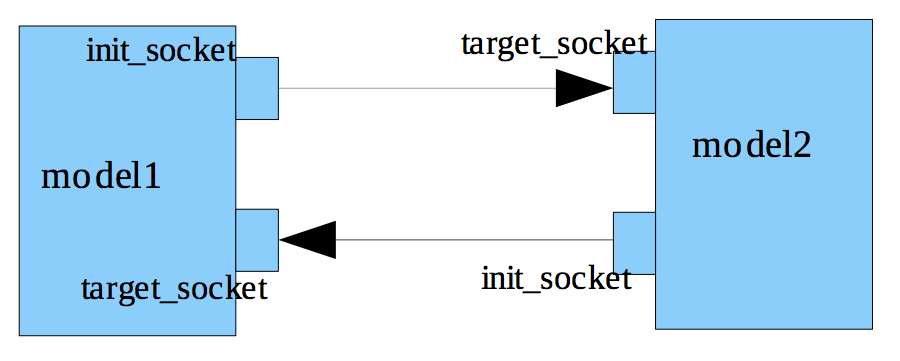
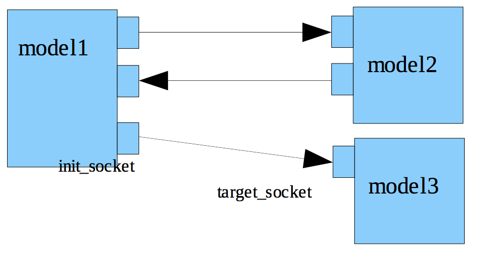
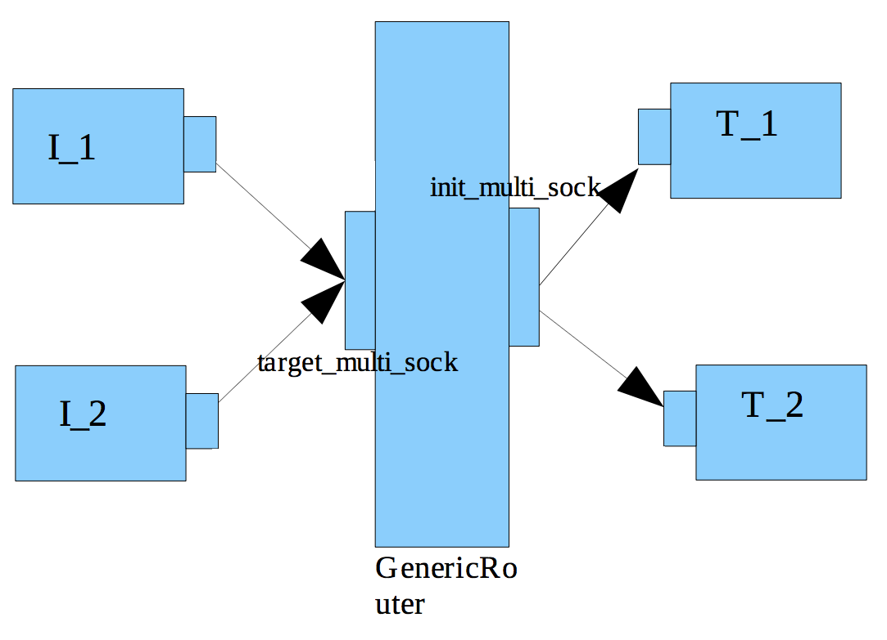
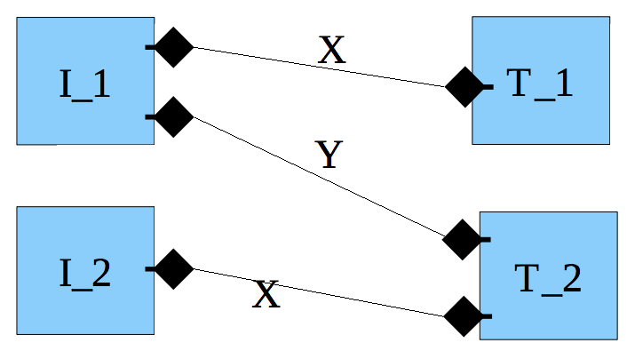
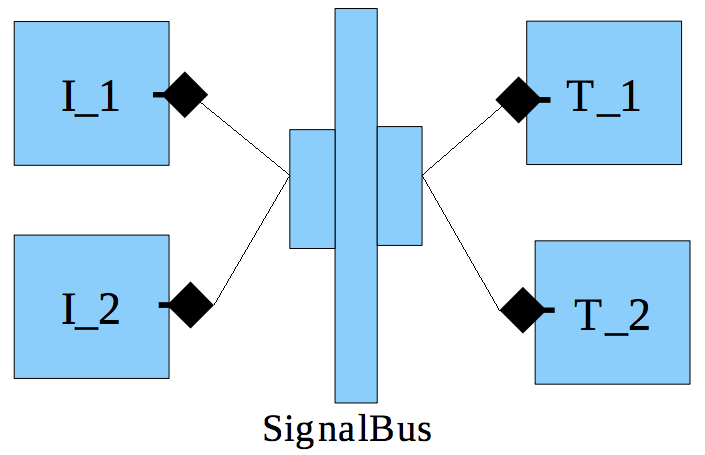

# GreenRouter
## Purpose

The purpose of this documentation is to explain the concept and usage of GenericRouter. An example will be shown for its efficient use in modelling.

## Scope

This document will cover the usage and APIs of GenericRouter and not go into the implementation details.

## Motivation

**GreenRouter** is used to connect the IPs using the GreenSocket infrastructure.

GreenRouter has an extremely flexible architecture, allowing routing and arbitration algorithms to be ‘plugged in’.

Several plugins are available for GreenRouter, for TLM-2.0-BP based bus routing, signal routing, Ethernet packet routing, etc. ther are also several arbitration algorithms available.

The flexible architecture means that GreenRouter can be used in many different scenarios to reduce the interconnect that would otherwise have to be written by hand.

## Overview

The TLM technology provides base protocol, sockets and payload to be used for communication between various IPs. These are commonly used for memory mapped bus communication, where the Target has certain registers with known addresses and Initiator can send transactions to read or write these registers.

In a real scenario, like modeling a SoC or Virtual Platform, it is frequently required to connect software models of many IPs together to create the complete system. As in real hardware, a bus can be used to connect different IP models. A particular model may act like an Initiator or Target or both. And also one model may be required to be connected to more than one models. Two models are easily connected using a pair of sockets, i.e. an initiator_socket in Init model and a target_socket in Target model.

The following diagram depicts a simple scenario in which the two models access each other.



When `model1` is connected to more than one models, it may require more than one init_socket, as shown in the below diagram. This can also be achieved by using multi-socket versions but still the user has to take care of which transport call to make on which port.



In the case shown above we can assume that `model2` and `model3` have disjoint address spaces. Then within 'model1' it can be decoded which payload should go to which socket depending upon the address configured in the payload. Further, when there are multiple initiators and targets all talking to each other, then making connections between each of them and doing decoding in each of them becomes a tedious and error-prone task.

Here the `GenericRouter` comes into use. A `GenericRouter` is placed between multiple initiator and target models and acts like a router for transactions on the bus connecting them. The `GenericRouter` is designed to provide the decoding logic and also scheduling algorithm for different transactions. So all the initiators and targets connect to the `GenericRouter` as shown in the diagram given below.



A `GenericRouter` handles the routing information within itself. And using this information, it appropriately forwards a transaction request to the desired target. By using a `GenericRouter`, making connections becomes easy. So now the Initiator need to contain only one init_socket for all the Targets it wishes to communicate to. And similarly, a target contain a single `target_socket` to receive transactions from any of the initiators.

To use a `GenericRouter`, the user has to configure address ranges (or some such similar information) on the target sockets at the Target IPs. The address range information is required by the `GenericRouter`. When the `init_socket` of `GenericRouter` is connected to targets one by one, it extracts this information from every target socket.

As an example, in the diagram given above, `T_1` and `T_2` are two targets that will recieve payloads from `I_1` and `I_2`. The payloads shall pass through the `GenericRouter` placed in between. The target_sockets of `T_1` and `T_2` will have certain address ranges configured on them in the following manner(note that, there is one more API to do this and it is discussed later)

```cplusplus
T_1.target_socket.base_addr = 0x40; T_1.target_socket.high_addr = 0x60
T_2.target_socket.base_addr = 0x80; T_2.target_socket.high_addr = 0x90
```
The above statements are telling that `T_1` expects to recieve payloads whose address lies in the range from 0x40 to 0x60. Similarly `T_2` expects to recieve payloads whose address lies in the range from 0x80 to 0x90. When the init_socket of GenericRouter is connected to `T_1` and `T_2`, it extracts this information from them and stores it internally. This information is then used at runtime to appropriately route the payload. So if the Router recieves two payloads, `P1` and `P2`, having their address field as 0x45 and 0x81 respectively, then `P1` is sent to `T_1` and `P2` is sent to `T_2`.

The address information is used by GenericRouter to generate an internal map of address ranges for each target. This map is used to direct the transactions to their desired targets. The basis on which user wishes to route transactions can be supplied as an ADDR_MAP template parameter at the time of instantiation. It gives complete freedom to the designer to use this GenericRouter for memory mapped communication, signal level communication etc. Its details are discussed below in the section on [Routing Algortihm](routing-algorithm.md).

So, when an initiator wishes to read/write some data on a target, it just makes a transport call on its init_socket with appropriate payload. This call is received and forwarded by the GenericRouter to the targets.

### Internals

The GenericRouter is defined in gs::gp namespace. To use it, one has to make following includes,

```cplusplus
#include “greenrouter/genericRouter.h”
using namespace gs::gp;
```

The GenericRouter accepts some template parameters, which allows user to work on different protocol types and different address decoding mechanism and some other related parameters(which are required when the user is extending base protocol). The template arguments have default values also, so that GenericRouter can be readily used on base protocol and a simple address map.

```cplusplus
template <BUSWIDTH, PORTMAX, TRAITS, RESP_TYPE, ADDR_ERR_RESP, SET_RESP_CALL, ADDR_MAP> GenericRouter
```

* `BUSWIDTH` : the wordlength for each individual data word transferred through the socket. It is not given a default value hence the user has to specify it always.
* `PORTMAX` : maximum number of tagret ports that can be connected to this bus. 

**Default value** 255.

* `TRAITS` : the protocol type for the transactions that are going to use this bus. 

**Default value** `tlm::tlm_base_protocol_types`.

* `RESP_TYPE` : type of the response for transport calls. 

**Default Value** `tlm::tlm_response_status`.

* `ADDR_ERR_RESP` : error response for transport calls. 

**Default Value** `tlm::TLM_ADDRESS_ERROR_RESPONSE`.

* `SET_RESP_CALL` : pointer to a function that can be used to set the response type in the transactions. 

**Default Value** `&TRAITS::tlm_payload_type::set_response_status`.

* `ADDR_MAP` : the address map class which will provide decoding functionality for the transactions. 

**Default Value** `SimpleAddressMap<TRAITS, PORTMAX>`.

#### Routing Algorithm

As mentioned above, the `ADDR_MAP` parameter is used to tell `GenericRouter` about the routing basis and algorithm to use. For this `ADDR_MAP` has to support two main functionalities, namely generateMap and decode. The generateMap is used to extract relevant information from the target sockets. For example when used for memory mapped communication, where the target can be assumed to have disjoint address spaces, the target_socket shall have address ranges preconfigured on them. Now, when the init_socket of GenericRouter is bound to target_socket of different targets in the system, generateMap extracts this information using the init_socket.

Later during simulation when the payloads are routed through this `GenericRouter`, it calls upon decode functionality of the `ADDR_MAP` to know the exact target on which the transaction should be forwarded.

As mentioned earlier, `GenericRouter` can also be used for fast signal communication. In this case the sockets at the initiator and target end are of type green_signal_socket. The GenericRouter is instantiated with appropriate template parameters and connected between initiators and targets as shown earlier. As mentioned in the signal socket documentation, the target green_signal_socket needs to have extensions configured on them. The `ADDR_MAP` used in this case is an ExtensionBased map because the payloads on signal sockets have appropriate extensions validated on them. When the `init_socket` of `GenericRouter` is bound to target sockets of targets, the `generateMap` functionality of `ExtensionBased` Map extracts the configuration from targets and stores it within itself.

Again, later during simulation when the payloads are routed through this GenericRouter, the decode functionality of `ExtensionBased` `ADDR_MAP` determines the exact target to which the payload should be forwarded.

Following diagrams help explain the use as `SignalBus`.



The adjacent diagram shows the case of two initiators driving signals for two Targets in the system. As shown, `T_1` has an in signal named `X`, for which it has an `sc_in` port that is driven by an `sc_out` of `I_1`. Similary, `T_2` has two `sc_in` ports to recieve `Y` from `I_1` and `X` from `I_2`.

The diagram below shows the same scenario when a GenericRouter is used as a SignalBus.



The adjacent diagram shows the case when a signal bus is placed between the initiators and targets for communicating signals. Each initiator contains an `initiator_signal_socket` and each target contains a `target_signal_socket`. These are connected to sockets of signal bus.

Please note that in this case the user does not configure any address ranges on the target_sockets of `T_1` and `T_2`. Instead it has to configure extensions on the target_sockets. These extensions correspond to the signal that the target is expecting. The user also has to specify the exact initiator from which a particular extension is expected. So for the above example we have:

```cplusplus
T_1.tar_sig_socket.set_source<X>(I_1.init_sig_socket.name());
T_2.tar_sig_socket.set_source<Y>(I_1.init_sig_socket.name());
T_2.tar_sig_socket.set_source<X>(I_2.init_sig_socket.name());
```

The signal socket documentation covers these APIs in more details.

Note that, a particular signal from an initiator could be driving more than one targets. This can be easily covered in our approach. For example if the signal `Y` from `I_1` was also going to `T_1`, then following additional configuration can be specified.

```cplusplus
T_1.tar_sig_socket.set_source<Y>(I_1.init_sig_socket.name());
```

Now when the **SignalBus** recieves a payload with extension corresponding signal `Y` validated, it
forwards it to both the targets `T_1` and `T_2`.
To use **GenericRouter** as a **SignalBus** one does not need to instantiate a **GenericRouter** and override the template parameters. Instead this specialization is already done and provided in the `genericSignalBus.h` in the `gs_generic_signal namespace`. Please also refer to the documentation of **SignalSockets** for a better understanding of APIs related to them.
These are just two of the many possible uses of the **GenericRouter**. It shows how it can be easily used when the requirements for the basis of routing varies.

#### Bus Protocol(scheduling)

The **GenericRouter** also has protocol ports. The protcol ports can be used to connect to a bus protocol class, by binding them to ports of `Protocol` class. The `Protocol` class acts as an arbiter and can be used to provide the scheduling algorithm for the transactions on the bus. The code package contains some example protocol (`simpleBus` and `dummy`) and scheduler(`fixedPriority` and `dynamicPriority`) classes.

Apart from routing of payloads the dmi and debug support is also provided in the **GenericRouter**.

### APIs

#### Assign an address

```cplusplus
void assign_address(baseAddr_, highAddr_, portNumber_)
``` 

Parameters:

* `baseAddr_` : base address
* `highAddr_` : high address
* `portNumber_` : port number

This is used when address based routing is being done. The target sockets can be configured with base and high addresses, or alternatively this API can be used to provide information to the GenericRouter.

#### Get number of routers

```cplusplus
unsigned int getCurrentNumRouters()
```

Return:

* The total number of routers instantiated in the system.

#### Get router ID

```cplusplus
unsigned int getRouterId()
```

Return: 

* The id of this GenericRouter.

## Example
### Usage

To use greenrouter include the following files:

```cplusplus
#include <greenrouter/genericRouter.h>
#include <greenrouter/protocol/SimpleBus/simpleBusProtocol.h>
#include <greenrouter/scheduler/fixedPriorityScheduler.h>
```

Create the following instances

```cplusplus
gs::gp::SimpleBusProtocol<32> p("Protocol", 10);
gs::gp::fixedPriorityScheduler s("Scheduler");
gs::gp::GenericRouter<32> r("Router");
```

The second argument of SimpleBusProtocol is the clock period duration.

Bind the protocol, router and scheduler ports as shown.

```cplusplus
r.protocol_port(p);
p.router_port(r);
p.scheduler_port(s);
```

Instantiate the target and define the target socket's base address and high address.

```cplusplus
target.target_port.base_addr = 0x0;
target.target_port.high_addr = 0xFFFF;
```

Now bind the Master's initiator port with the router target port and router's initiator port with slave's target port.

```cplusplus
master.init_port(router.target_socket); router.init_socket(slave.target_port);
```

Note that there can be many initiators and many targets, bind the ports of initiators and targets in the similar fashion.

Refer to the `example_simple.cpp` file kept in the `example/simple` directory.

### Simple example


A small example with the name **simple** is kept in the `example` directory. In this example, sillysort is a master which reads/writes on the memory and sorts the string kept in the memory.

Each simple memory has some address range defined. From `example_simple.cpp` it can be seen that `SimpleMemory1` has memory range defined from 0x0 to 0x10 and `SimpleMemory2` has range defined from 0x11 to 0xffff.

As the master is connected to the router, it need not worry to find the correct slave and send the transaction to the correct slave. It justs prepares the transaction and sends it to router. It is the function of router to see the address in the transaction and correctly routes the packet to the slave.

The main thread in the sillysort is `run()`. It first writes the string from the memory. Then in a pass, take two adjacent characters and swap them if first character is greater then the other.
Build (make) and run the example. You can see the various passes and in the end the sorted string in the memory.

Note: One important thing to note here is that the router routes the packet based on the starting address only and does not care about the length of the packet (may be it exceeds the given range of memory). But this can be easily taken care in the target IP.
